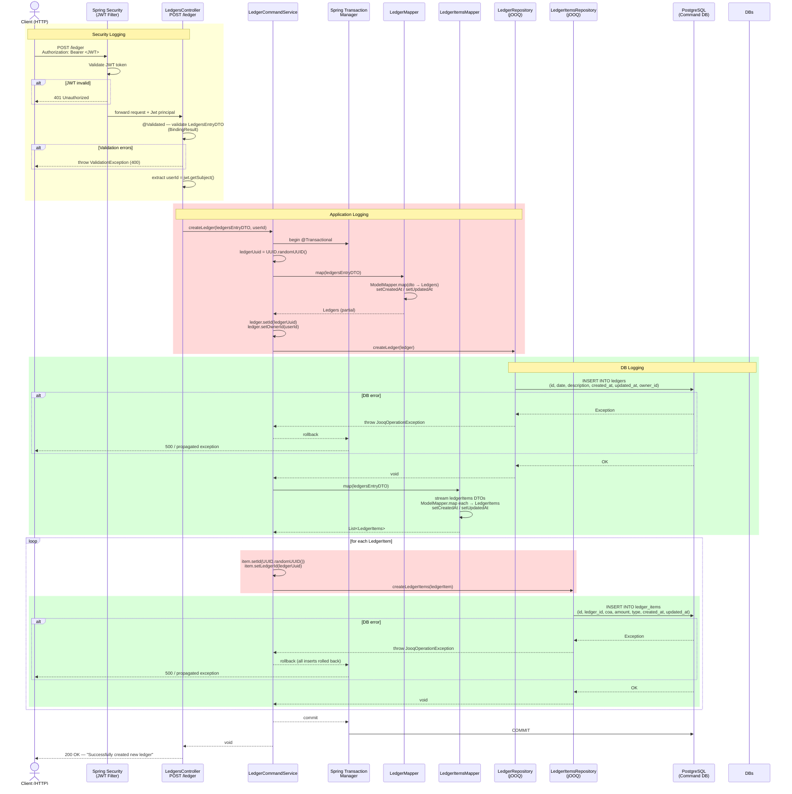

## Flow Summary

| Step | Who                     | What                                              | Log Level | Log Message                                                  |
| :--: | ----------------------- | ------------------------------------------------- | :-------: | ------------------------------------------------------------ |
|  1   | Client → Security       | `POST /ledger` with `Authorization: Bearer <JWT>` |     —     | _(handled by framework)_                                     |
|  2   | Security                | Validates JWT; extracts `Jwt` principal           |  `WARN`   | `"JWT validation failed: {reason}"`                          |
|  3   | Controller              | Validates `LedgersEntryDTO` via `@Validated`      |  `ERROR`  | `"Validation errors: {bindingResult.getAllErrors()}"`        |
|  4   | Controller              | Extracts `userId` from `jwt.getSubject()`         |     —     | —                                                            |
|  5   | Controller → Service    | Calls `createLedger(dto, userId)`                 |  `DEBUG`  | `"New ledger created: {ledgersEntryDTO} for user: {userId}"` |
|  6   | `LedgerMapper`          | Maps DTO → `Ledgers` POJO                         |     —     | —                                                            |
|  7   | Service                 | Sets `id` + `ownerId`; generates `ledgerUuid`     |     —     | —                                                            |
|  8   | `LedgerRepository`      | jOOQ `INSERT INTO ledgers` — **success**          |  `DEBUG`  | `"Ledger created: {ledger}"`                                 |
|  8e  | `LedgerRepository`      | jOOQ `INSERT INTO ledgers` — **DB error**         |  `ERROR`  | `"Error creating ledger"` _(+ exception stack)_              |
|  9   | `LedgerItemsMapper`     | Maps each item DTO → `LedgerItems` list           |     —     | —                                                            |
|  10  | Service (loop)          | Assigns `UUID` + `ledgerId` to each item          |  `DEBUG`  | `"ledgerItem created: {ledgerItem}"`                         |
|  11  | `LedgerItemsRepository` | jOOQ `INSERT INTO ledger_items` — **success**     |  `DEBUG`  | _(logged via step 10 before insert)_                         |
| 11e  | `LedgerItemsRepository` | jOOQ `INSERT INTO ledger_items` — **DB error**    |  `ERROR`  | `"Error creating ledger items"` _(+ exception stack)_        |
|  12  | Transaction             | Commits or full rollback on exception             |     —     | —                                                            |
|  13  | Controller              | Returns `200 OK`                                  |  `DEBUG`  | `"New ledger created: {ledgersEntryDTO} for user: {userId}"` |

### Log Level Guidelines

| Level   | When to use                                                                                            |
| ------- | ------------------------------------------------------------------------------------------------------ |
| `DEBUG` | Normal successful operations; method entry/exit with key identifiers (`ledgerId`, `userId`)            |
| `INFO`  | Significant business events worth tracking in production (e.g. ledger committed)                       |
| `WARN`  | Recoverable issues or security-relevant events (e.g. JWT rejected, unauthorised access attempt)        |
| `ERROR` | Unexpected failures that cause the request to fail; always attach the exception object for stack trace |

### Recommended Production Log Format

```text
[LEVEL] [class#method] message — key=value pairs
```

**Examples:**

```text
DEBUG LedgerCommandService#createLedger  Ledger created: id=3fa85f64, ownerId=user-001
DEBUG LedgerCommandService#createLedger  ledgerItem created: id=7b3c1a22, ledgerId=3fa85f64, coa=1010, type=DEBIT
ERROR LedgerRepository#createLedger      Error creating ledger — exception attached
WARN  LedgersController#newLedger        Validation errors: [field 'date' must not be null]
```

> **Note:** Never log sensitive financial amounts at `DEBUG` in production — gate behind `log.isDebugEnabled()` or use `INFO` with redaction.
