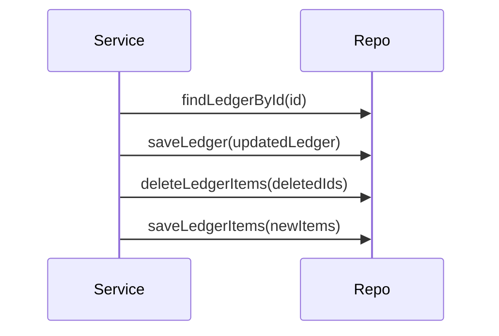
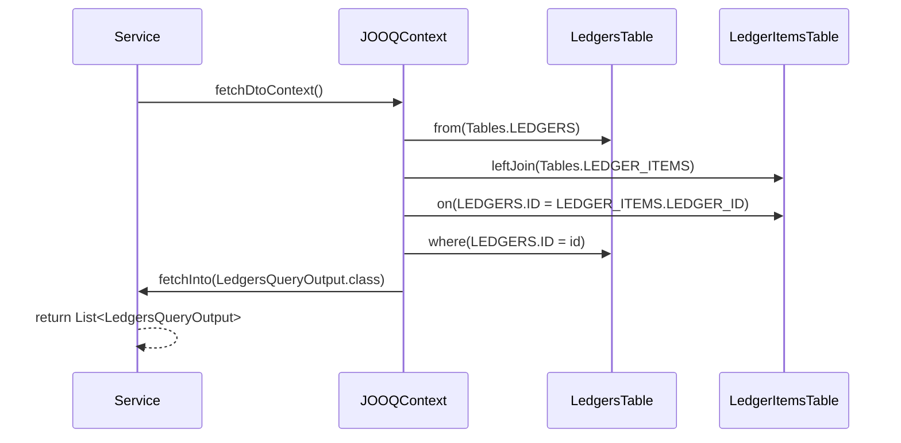
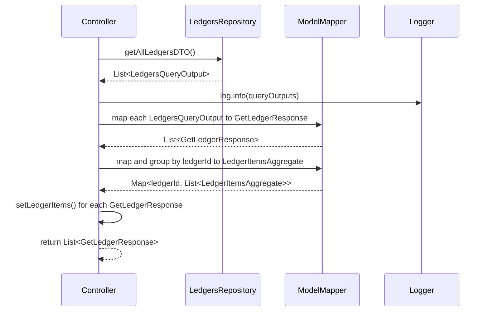
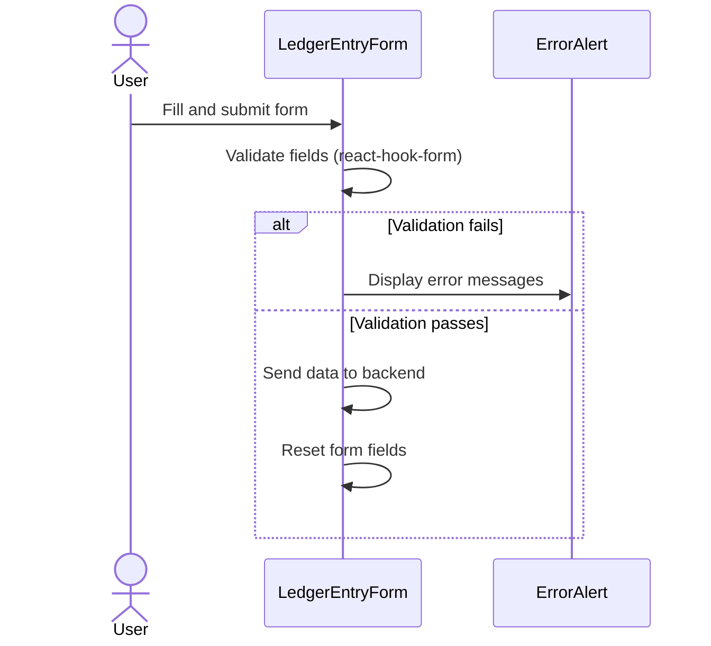
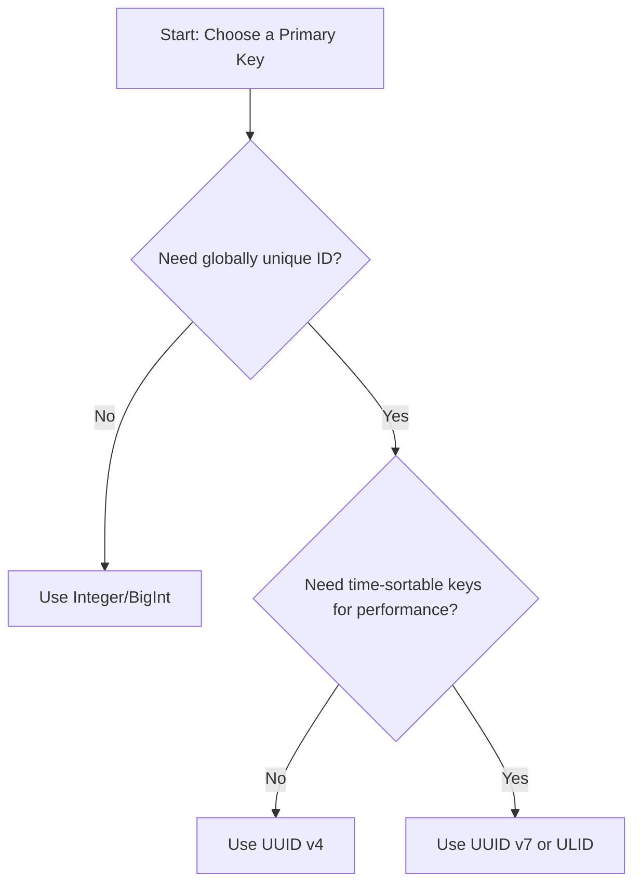

# Accounting_CQRS_Project

## Technologies

### Backend: Springboot/Java

- DB Migration Management: Flyway
- DB Schema to Pojos class autogen: JOOQ
- setup profile and manage deployment setting
- logging level and log file management

### Frontend: React/TypeScript

- Multiple SPA Pages: React Router
- Form Management with Dynamic input field: ReactHookForm
- MUI Component Library

### DevOps Tools

- set up AWS Cloud Service with IaC tools: [Terraform and HCP](https://app.terraform.io/app/thee5176/workspaces/AWS_for_Accounting_Project)
- store Build Image and Deployment with Container Management tools: [Docker and Dockerhub](https://hub.docker.com/repositories/thee5176)
- explore Git tools: Submodule, Flow, Stash-checkout
- CI/CD pipeline: Github Workflow

## Table of Content

1. [Install and Run Process](#install-and-run-process)
2. [Highlight Functionality](#highlight-functionality)
3. [Development Principle](#development-principle)
4. [System Design](#system-design)
5. [Technologies Used (Trial & Error)](#technologies-used-trial--error)
6. [Lessons Learned (Team Meeting & Feedback)](#lessons-learned-team-meeting--feedback)

## Install and Run Process

```bash
#1 Prepare directory and clone from github
git clone --recurse-submodules -j3 https://github.com/Thee5176/SpringBoot_CQRS
cd SpringBoot_CQRS

#2 make migration, build process

##2.1 Command Unit: spin up postgres container and set up DB
cd springboot_cqrs_command
chmod +x mvnw
./mvnw clean package
cd ..

##2.2 Query Unit:
cd springboot_cqrs_query
chmod +x mvnw
./mvnw clean package
cd ..
```

### 3 Start All Service

```bash
docker compose build --no-cache
docker compose up -d
```

## Highlight Functionality

### Springboot Command Service

| Feature                             | Description                                                                                | Reference Link                                                                                                                                                                        |
| :---------------------------------- | :----------------------------------------------------------------------------------------- | :------------------------------------------------------------------------------------------------------------------------------------------------------------------------------------ |
| Custom Object Mapper                | Configure ModelMapper Beans to customize field mapping between DTO and two Domain Entities | [ModelMapperConfig.java](https://github.com/Thee5176/SpringBoot_CQRS_Command/blob/develop/src/main/java/com/thee5176/ledger_command/Infrastructure/Config/ModelMapperConfig.java#L21) |
| Multi-Step Process in Service layer | Transaction Management for multiple entity mutation within single method                   | [LedgerCommandService.java](https://github.com/Thee5176/SpringBoot_CQRS_Command/blob/develop/src/main/java/com/thee5176/ledger_command/Domain/Service/LedgerCommandService.java#L28)  |
| Migration Management with Flyway    | Handle creation of multiple tables, foreign keys, and indexes using SQL scripts            | [V1\_\_init.sql](https://github.com/Thee5176/SpringBoot_CQRS_Command/tree/develop/src/main/resources/db/migration)                                                                    |

#### Multi-Step Process in Service layer - Sequence Diagram



---

## Springboot Query Service

| Feature                    | Description                                                                                      | Reference Link                                                                                                                                                                        |
| :------------------------- | :----------------------------------------------------------------------------------------------- | :------------------------------------------------------------------------------------------------------------------------------------------------------------------------------------ |
| Join Table Query with JOOQ | Tackle N+1 Problem in Repository Layer using JOIN query                                          | [LedgersRepository.java](https://github.com/Thee5176/springboot_cqrs_query/blob/develop/src/main/java/com/thee5176/ledger_query/Infrastructure/repository/LedgersRepository.java#L57) |
| Flatten Data Extraction    | Tackle N+1 Problem in Service Layer by creating Map of Id to Entity (removes recursive querying) | [LedgersQueryService.java](https://github.com/Thee5176/SpringBoot_CQRS_Query/blob/develop/src/main/java/com/thee5176/ledger_query/Domain/service/LedgersQueryService.java#L24)        |

### Join Table Query with JOOQ - Sequence Diagram



### Flatten Data Extraction Transaction - Sequence Diagram



---

### Validation Condition and Error Message - Sequence Diagram



---

## Development Principle

| Branch Type | Branch From | Usage                              | When to Merge Back                      | Notes                |
| :---------- | :---------- | :--------------------------------- | :-------------------------------------- | :------------------- |
| main        | —           | For deploying new features         | Only merge back when codebase confirmed | Deployment branch    |
| develop     | main        | Manage dev of multiple features    | Only merge back when codebase confirmed | Integration branch   |
| feature     | develop     | Local development & atomic commits | No restrictions                         | Parallel development |
| hotfix      | main        | Bug fixes                          | Merge back once fixed                   | Multiple allowed     |

**Additional Notes:**

- Follow a Top-Down Software Development Approach: DB Design → Module Design → Implementation
- Use Git best practices as per "[A successful Git branching model](https://nvie.com/posts/a-successful-git-branching-model/)"
- Manage parallel branches with clear merge strategy for stability

---

## System Design

### Frontend: UI Design (Wireframe + Component Planning)

- **Wireframe Design**
  

- **Component Planning**
  

### Backend: DB and Module Design

#### Version 1

- **DB Design:**
  - Table to save values of Accounting Transaction as "Transaction" Table
  - Table to save values of Accounting Entries as "Entries" Table
- **Module Design:**
  - Command and Query Service hosted separately.
  - Separate DB modules for SQL (reliable write) and NoSQL (faster read).
  - CQRS Pattern with Kafka Message Service and Eventual Consistency.
  - Repository library: JOOQ on the Command side.
    

#### Version 2

- **DB Design:**
  - Change "Transaction" Table to "Ledgers"
  - Change "Entry" Table to "LedgerItems"
- **Module Design:**
  - Combined Database (SQL only).
  - Removed Message Service and Eventual Consistency Service.
  - Repository library: Both use JOOQ for consistency.
    

---

## Technologies Used (Trial & Error)

- **Git Best Practices:**
  - Manage local branches according to [GitFlow](https://nvie.com/posts/a-successful-git-branching-model/).
  - Review changes before merge with [Pull Requests](https://github.com/pulls?q=is%3Apr+author%3AThee5176+archived%3Afalse+repository%3Bspringboot*).
  - Manage separate histories with [Git Submodules](https://github.com/Thee5176/SpringBoot_CQRS/tree/main).

- **GitHub Actions:**
  - Set up continuous integration for verifying build process.
  - [Command Unit Workflow](https://github.com/Thee5176/springboot_cqrs_command/actions/workflows/testrun.yaml)
  - [Query Unit Build Workflow](https://github.com/Thee5176/springboot_cqrs_query/actions/workflows/testrun.yaml)

- **Flyway:**
  - Database migration service configured in `pom.xml`.
  - Version-controlled scripts in `src/main/resources/db/migration`.

- **JOOQ:**
  - Top-Down development process with JOOQ Codegen.
  - Schema design via [DB Design Document](https://dbdocs.io/theerapong5176/Springboot_CQRS?view=relationships).

- **Testing:**
  - **Arrange-Act-Assert Process:**
    1. Arrange - Establish testing data
    2. Act - Run the test subject
    3. Assert - Check the result
  - **JUnit & Mockito:** Unit and integration testing for internal components.

---

## Lessons Learned (Team Meeting & Feedback)

### Microservice vs Monolith Architecture

| Feature         | Monolith                               | Microservice                    |
| :-------------- | :------------------------------------- | :------------------------------ |
| **Performance** | Potentially faster (in-process calls). | Slower (network latency).       |
| **Resource**    | Less overhead, single unit.            | Higher overhead per service.    |
| **Team Work**   | Tightly coupled.                       | Loosely coupled, independent.   |
| **Scaling**     | Slower to start scaling.               | Faster scaling as system grows. |

### Database Primary Keys (UUID vs Integer)

| Key Type    | Bit Count | Storage      | Sortable | Randomness      |
| :---------- | :-------- | :----------- | :------- | :-------------- |
| **UUID v7** | 128-bit   | ~3.4 x 10^38 | Yes      | High (74 bits)  |
| **UUID v4** | 128-bit   | ~3.4 x 10^38 | No       | High (122 bits) |
| **ULID**    | 128-bit   | ~3.4 x 10^38 | Yes      | High (80 bits)  |
| **Integer** | 32-bit    | ~4.3 billion | Yes      | None            |

#### Decision Matrix

- **Integer/BigInt:** Best for simple, single-database apps.
- **UUID v4:** Use in distributed systems where order is not important.
- **ULID/UUID v7:** Ideal for distributed systems requiring globally unique, time-sortable keys.



### Additional Best Practices

- **Ubiquitous Language:** Avoid names close to reserved keywords.
- **Validation Chain:** Validate early and across multiple layers (Frontend -> DTO -> DB).
- **Master Data:** Balance between **Enums** (fast, static) and **Tables** (dynamic, soft).
